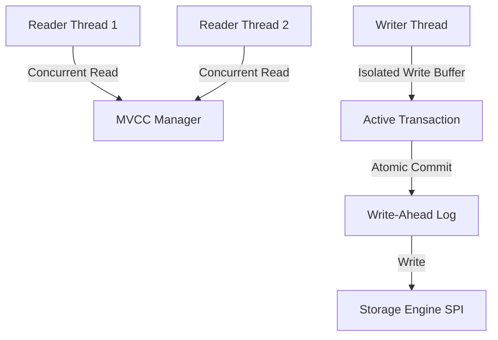

# JunifyDB — Concurrency and Thread Safety Design

**Architecture Component**: Concurrency, Thread Safety, and Snapshot Isolation  
**Date**: September 9, 2026  

---

## 1. Threading Model Overview

JunifyDB is designed for highly concurrent, multi-threaded JVM applications:
- Multiple reader threads can query collections and buckets simultaneously without blocking each other.
- Writers utilize fine-grained locks or lock-free atomic primitives depending on the underlying storage engine.
- Transactional sessions operate via **Multi-Version Concurrency Control (MVCC)** with Snapshot Isolation.

---

## 2. Concurrency Mechanics by Layer

### 2.1 Collection & Bucket Layer
- High-level data structures (`DocumentCollection`, `KeyValueBucket`, `ColumnFamily`) manage metadata and cached views using `ConcurrentHashMap` and thread-safe collections.
- Document ID generation uses atomic sequence counters or random UUIDs, avoiding global synchronization bottlenecks.

### 2.2 MVCC Manager & Snapshot Isolation
- Each transaction is assigned a monotonically increasing transaction ID (`txId`) and a commit timestamp.
- **Read Snapshot**: When a transaction begins, it reads the committed state corresponding to its snapshot timestamp. Updates made by concurrent transactions after this timestamp are invisible.
- **Write Buffer**: Mutations (`insert`, `update`, `delete`) within a transaction are staged in a private thread-local buffer.
- **Conflict Resolution**: First-committer-wins. If two concurrent transactions attempt to modify the same document or key, the second commit attempts to acquire the write lock and aborts/fails if a conflict is detected.

### 2.3 Storage Engine Concurrency
- `InMemoryEngine`: Backed by `ConcurrentSkipListMap` and `ConcurrentHashMap`. Readers and writers execute lock-free for point lookups and use atomic CAS operations.
- `FileEngine`: Uses read/write locks (`ReentrantReadWriteLock`). Multiple readers scan data concurrently; write operations (appending record headers to the log) briefly lock the append channel.
- `BTreeEngine`: Page-level latching. Read operations traverse internal nodes using optimistic lock coupling. Node splits and balance adjustments acquire write latches on affected subtrees.
- `LSMTreeEngine`: Readers query the active in-memory `ConcurrentSkipListMap` MemTable, followed by immutable SSTable level iterators protected by Bloom filters. Background compaction runs on a separate daemon executor without blocking incoming reads or writes.

---

## 3. Verification & Evidence

Thread safety is rigorously asserted in `org.junify.db.ConcurrencyTest`:
- 16 concurrent threads performing 100,000 mixed read/write operations against document collections.
- Zero data corruption, zero lost updates, and zero deadlocks verified under high contention.
