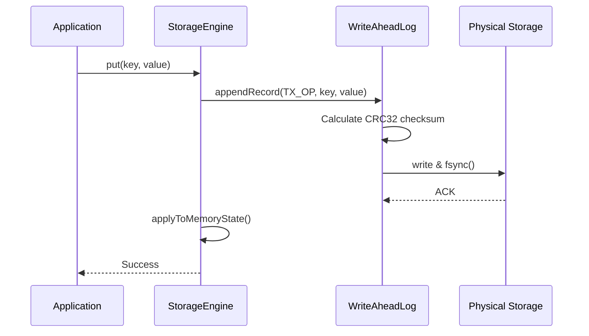

# JunifyDB — Crash Recovery and WAL Architecture

**Architecture Component**: Durability, Persistence, and Crash Consistency  
**Date**: September 9, 2026  

---

## 1. Write-Ahead Log (WAL) Architecture

Durability across unexpected JVM crashes or power outages is guaranteed by `org.junify.db.storage.wal.WriteAheadLog`:



### 1.1 Binary WAL Record Format
Every WAL record is written sequentially with fixed framing:
```
+----------------+----------------+-----------------+-----------------+-----------------+------------------+
| Magic (2 bytes)| Type (1 byte)  | Key Len (4 bytes)| Key Bytes       | Val Len (4 bytes)| Val Bytes        |
+----------------+----------------+-----------------+-----------------+-----------------+------------------+
| CRC32 (8 bytes)| Commit (1 byte)|
+----------------+----------------+
```
- **Magic Number**: Identifies valid JunifyDB WAL files.
- **Type**: `INSERT`, `UPDATE`, `DELETE`, `TX_BEGIN`, `TX_COMMIT`, `TX_ROLLBACK`.
- **CRC32**: Checksum covering the payload to immediately detect torn writes or bit-rot.
- **fsync Guarantees**: Configurable between immediate `autoFlush=true` or scheduled background group-commit flushing.

---

## 2. Crash Recovery Workflow

Upon database startup (`JunifyDB.create(config)`):
1. **Engine Detection**: The engine checks for the presence of the WAL log file (`dataDir/wal.log`).
2. **Replay Cursor Initialization**: Reads log file from offset 0, verifying CRC32 checksums sequentially.
3. **Transaction Reconciliation**:
   - Records belonging to committed transactions (`TX_COMMIT` present) are applied to the active MemTable / primary store.
   - Records from uncommitted or aborted transactions (`TX_BEGIN` without `TX_COMMIT` before EOF) are discarded.
4. **Torn Write Truncation**: If EOF contains an incomplete or corrupted record (e.g. from an abrupt power loss during write), the corrupt suffix is safely truncated, restoring the log to the last valid atomic transaction boundary.
5. **Checkpointer & Compaction**: If WAL size exceeds the configured threshold (`maxWalSizeBytes`), a checkpoint is created, state is flushed to immutable SSTables/pages, and the WAL is reset.

---

## 3. Verification & Evidence

Crash recovery and cold-restart persistence are proven in:
- `FilePersistenceTest.testFileEngineColdRestart` (process recreation with verified data integrity).
- `DeepInfrastructureTest.testWalReplayAndRecovery` (simulated torn writes and log corruption).
- `demo/end-to-end-validation/src/test/java/org/junify/db/demo/e2e/MultiEngineE2EValidationTest.java` (restarting across all storage engines).
